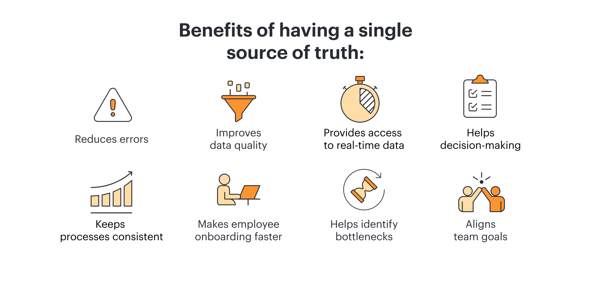

# Source of truth

At the foundation of a development environment is *Source Control Management* such as CVS, Subversion, more recently SourceForge, GitHub, GitLab, Confluence, or Jira. An ecosystem of tools surrounds the unit testing, end to end testing, compliancy, static and dynamic security.

One note, is that organizations struggle with disconnected development environments, and although many work towards a "Single" source of truth, the reality is that there ends up being multiple repositories federated or "glued" together.

Developers use an elaborate system of creating "snapshots" of the applciation code, so that they can work on a new feature, and then that code gets committed. Often, heard in a scrum is a discussion about why a PR was rejected.

Once the Pull Request passes all the validation tools, it can be merged into main, a new version tag can be used to promote through a staging environment into QA, or to be deployed into production using Blue-Green or A/B rollouts can be done by geography.
